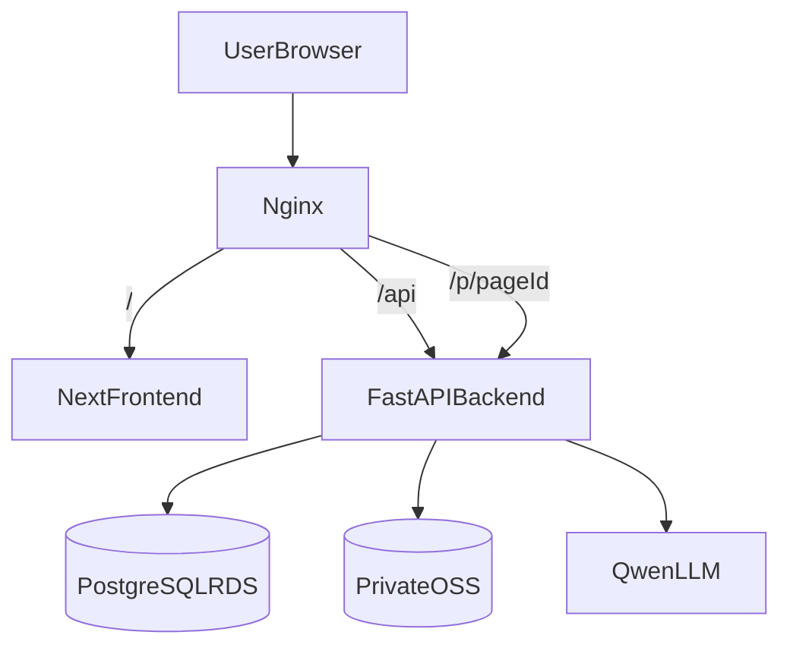
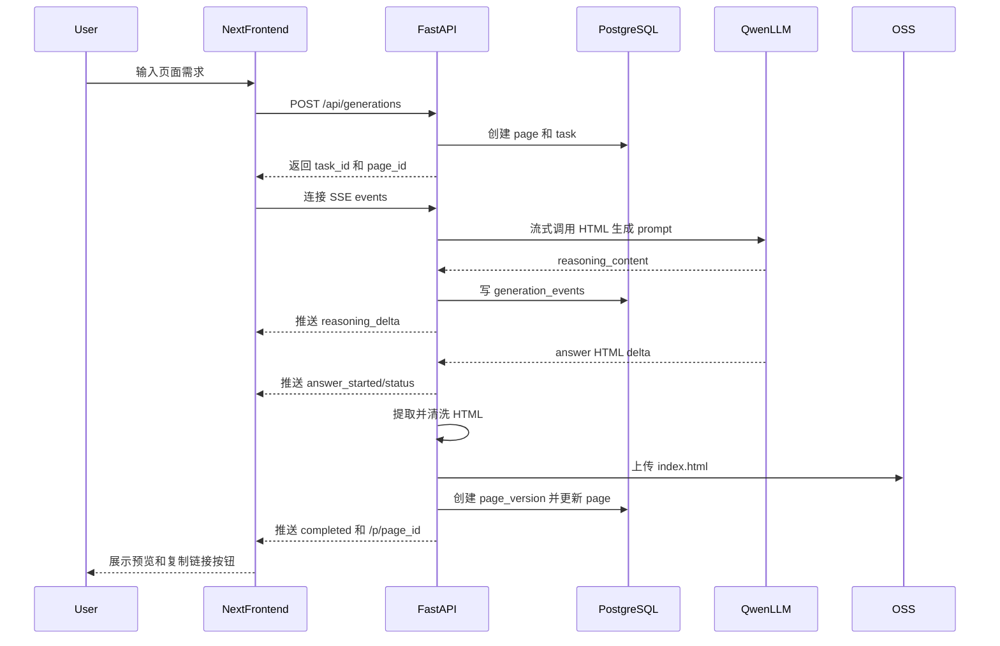
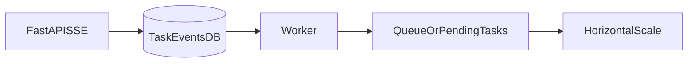

# MVP 主流程实现计划

## 计划概述

实现“自然语言生成 HTML 页面”的 MVP 主流程：Next.js 负责浅色极简首页与预览交互，FastAPI 负责 LLM 流式生成、数据库、OSS、权限与页面访问网关。第一版使用 SSE 长连接并记录任务事件，为未来后台队列升级保留清晰入口。

## 待办项

- 初始化 Next.js 前端与 FastAPI 后端目录结构。
- 实现后端配置、数据库连接、迁移和 `default_test` 用户初始化。
- 重写 Python LLM 流式客户端并实现 OSS StorageProvider。
- 实现生成任务 API、SSE 事件、HTML 清洗、上传 OSS 和版本记录。
- 实现浅色极简首页、reasoning 展示、创建中状态、预览和复制链接。
- 实现 `/p/{page_id}` 页面访问网关与基础权限校验。
- 补充 Docker/Nginx/端口配置，并记录未来后台队列升级触发条件。
- 完成本地或服务器端端到端验证。

## 已确认决策

- 技术栈：`/root/star-page/code/frontend` 使用 Next.js，`/root/star-page/code/backend` 使用 FastAPI。
- 生成链路：第一版使用 SSE 长连接，并把任务状态与事件写入 PostgreSQL。
- 页面风格：首页采用浅色极简，接近 Gemini 官网的输入体验。
- 访问方式：生成链接走应用网关 `/p/{page_id}`，不直接暴露 OSS 地址。
- 权限策略：当前 demo 使用默认用户 `default_test`，页面默认 `public`，但仍保留 owner/visibility/permission 数据结构。
- 防火墙策略：公网只开放 `22/80/443`；Next.js `3000` 与 FastAPI `8000` 只允许 Nginx 或 Docker 内部网络访问。

## 目标架构

## 目录与模块规划

- `/root/star-page/code/frontend`
  - Next.js 首页、生成状态组件、预览组件、复制链接按钮。
  - 通过 `NEXT_PUBLIC_API_BASE_URL` 或同源 `/api` 调用后端。
- `/root/star-page/code/backend`
  - FastAPI 应用入口、配置加载、数据库连接、迁移、模型定义。
  - Python 版 LLM 客户端，先实现 OpenAI-compatible 协议以接入 Qwen。
  - OSS StorageProvider，负责上传和读取私有 Bucket 内的 HTML。
  - 页面生成服务、权限服务、HTML 清洗服务。
- `/root/star-page/code/docker-compose.yml`
  - 编排 frontend、backend，后续可加 nginx 配置或部署说明。
- `/root/star-page/config/env.example`
  - 补充前后端、数据库、OSS、LLM、服务端口等模板变量。
- `/root/star-page/doc/20260524/`
  - 记录 MVP 主流程实现方案与未来后台队列升级触发条件。

## 数据库设计

第一版创建并迁移以下表：

- `users`：默认插入 `default_test`。
- `pages`：页面主记录，包含 `owner_user_id`、`visibility`、`status`、`current_version_id`。
- `page_versions`：每次生成的 HTML 版本，记录 `prompt`、`storage_key`、模型信息与版本号。
- `page_permissions`：权限表，当前至少写入 owner 权限。
- `generation_tasks`：生成任务状态，支持 `pending/running/succeeded/failed/cancelled`。
- `generation_events`：记录 SSE 事件，支持断线排查与未来改造成队列后的状态回放。

## API 规划

- `POST /api/generations`
  - 使用 `default_test` 创建页面和生成任务，返回 `task_id`、`page_id`。
- `GET /api/generations/{task_id}/events`
  - SSE 推送 `reasoning_delta`、`answer_started`、`status`、`completed`、`failed`。
- `GET /api/pages/{page_id}`
  - 返回页面元数据、生成状态与可访问链接。
- `GET /p/{page_id}`
  - 页面访问网关：校验页面状态与权限，从 OSS 读取当前版本 HTML，设置 CSP 后返回。

## 生成流程

## Prompt 与安全策略

- 后端使用专业系统 prompt，让模型输出单文件 HTML：完整文档结构、内联 CSS、响应式布局、现代审美、内容层级清晰。
- 明确禁止 Markdown 代码块、JavaScript、事件属性、`javascript:` 链接、`iframe`、`form`。
- 后端仍做 HTML 清洗：移除高风险标签和属性，并在 `/p/{page_id}` 返回时设置 CSP。
- 第一版不支持用户自定义 JS，不支持动态表单提交。

## 前端体验

- 首页居中大输入框，浅色背景、宽松留白、简洁按钮。
- 生成中展示 reasoning 卡片，直接显示 Qwen 返回的 `reasoning_content`。
- 进入 answer 阶段后隐藏 HTML 内容，只展示“页面创建中...”。
- 完成后展示预览卡片：iframe 预览、打开页面按钮、复制链接按钮。
- 错误时展示友好的失败原因，并允许用户重新提交。

## 部署与端口

- Nginx 公网入口：`80/443`。
- Next.js 内部端口：`3000`。
- FastAPI 内部端口：`8000`。
- Nginx 路由建议：
  - `/` 转发到 Next.js。
  - `/api/` 转发到 FastAPI。
  - `/p/` 转发到 FastAPI。
- 阿里云安全组/防火墙保持只开放 `22/80/443`；如有固定公网 IP，后续建议把 `22` 限制为固定 IP/32。

## 后台队列升级记录

第一版不引入队列，但在文档和代码边界中保留升级入口。当出现以下情况时，提醒升级为后台队列 + Worker：

- 生成任务经常超过 1-2 分钟。
- 同时生成人数增加，FastAPI 长连接明显变多。
- 用户刷新页面后需要可靠恢复生成进度。
- 需要失败自动重试、任务排队、取消任务。
- 需要多台机器横向扩容生成能力。

升级路径：

## 验证计划

- 本地启动 frontend 与 backend，确认首页可以提交需求并接收 SSE。
- 使用 Qwen 真实配置跑通一次生成，确认 reasoning 展示、answer 阶段隐藏、最终预览成功。
- 检查 PostgreSQL 中用户、页面、版本、任务、事件记录完整。
- 检查 OSS 中生成路径符合 `pages/{page_id}/versions/{version_id}/index.html`。
- 访问 `/p/{page_id}`，确认 HTML 从网关返回且 OSS 地址未暴露。
- 检查防火墙策略不需要开放 `3000/8000`。
