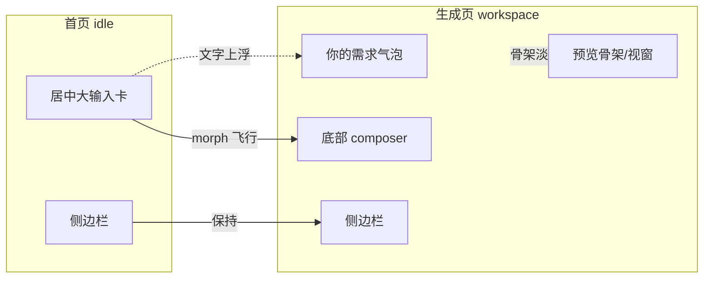

# 首页 ↔ 生成页衔接过渡动画（规划与实施记录）

> 本文由 `.cursor/plans/` 的同名规划文档归档整理而来，去除 plan 专用元数据，
> 并补充实际执行结果与最终选型决策，便于后续追溯。

## 背景与问题

首页（`status === "idle"` 的居中 hero：logo + 标题 + 大输入卡 + 推荐 chips）与生成
工作区（`workspace-layout` 三栏：侧边栏 + 对话流 + 预览）是两套完全不同的 DOM，靠条件
渲染切换。用户在首页点「创建」后，React 瞬间卸载一棵树、挂载另一棵，页面**直接硬闪**到
生成页，过渡不平滑、体验突兀。

两态之间其实有可作为过渡抓手的共享元素：

- 侧边栏：两态都有，应保持不动。
- 输入卡：首页居中大卡 ↔ 工作区底部 compact composer。
- 用户输入的文字：提交后输入框清空，转为对话流里的「你的需求」气泡。

## 设计方案：三套动画原型并排对比选型

复用项目既有的「多端口静态原型对比」模式（平行于 `script/preview-logo/`），新建
`script/preview-transition/`，用公共骨架重建两态 DOM + 导演控制条，三套方案分别跑在
3001 / 3002 / 3003 供选型，并带「模拟 reduced-motion」勾选验证无障碍降级。

| 端口 | 方案 | 机制 | 优点 | 取舍 |
| --- | --- | --- | --- | --- |
| 3001 | 纯 CSS 交叉过渡 | 旧层淡出上移收缩 + 新层淡入上浮，叠放交叉切换 | 零依赖、全浏览器一致 | 共享元素不连续飞行 |
| 3002 | View Transitions API | `startViewTransition` 包裹，`view-transition-name` 标记输入卡/侧栏/logo 自动 morph | 惊艳、侵入小、零依赖 | 兼容性需降级（Safari 18+ / Firefox 进行中） |
| 3003 | motion 库 | 命令式 FLIP 输入卡飞行 + 文字上浮成气泡 + 内容 stagger 入场 | 控制力最强、最有作品感、跨浏览器一致 | 需引入依赖 |

## 最终选型与降级链决策

经三端口逐一对比「生成 / 返回首页 / 历史进入」三种切换后，确定采用
**「主方案 + 多级降级」的运行时降级链**：

1. **主方案：方案三（motion 库）** —— 默认使用，FLIP 飞行 + 文字变气泡 + 内容
   stagger，观感最佳。
2. **降级一：方案二（View Transitions API）** —— 当 motion **依赖加载失败或其他情况**
   时启用，原生、零依赖、共享元素自动 morph。
3. **降级二：方案一（纯 CSS 交叉过渡）** —— 当 View Transitions **发生兼容性或其他
   问题**（浏览器不支持）时启用，作为全浏览器一致的最后防线。
4. **兜底：直接切换** —— `prefers-reduced-motion: reduce` 时不做任何动画，等同现状但
   不报错。

该降级链是**运行时**按环境能力逐级回退（非开发期二选一），实现细节与可复用经验沉淀在
`wiki/frontend-home-workspace-transition.md`。

## 实施（生产集成）

在 `code/frontend/app/page.tsx` + `globals.css` 落地：

- `npm i motion`，运行时**动态 import**（`import("motion")`）加载主方案，失败自动降级。
- 新增统一过渡协调器 `runStageTransition(stage, motionLib, mutate)`，按降级链分派；三处
  会切换视图的入口 `handleSubmit`（首页→生成）/ `startNewChat`（生成→首页）/
  `restoreHistoryItem`（历史进入）统一改为把决定新视图的 `setState` 包进 `playTransition`。
- 两态 `<main>` 外层包一个稳定的 `.app-stage` 容器并各加 `key`；用 `flushSync` 同步提交
  状态切换以便测量 / 让浏览器捕获新 DOM；动画一律走内联样式避免被 React 重渲染覆盖。
- 关键内容容器打 `data-anim-stagger` 供 motion 逐项编排；View Transitions 降级路径用
  `html.vt-switching` 作用域化的 `view-transition-name` 与 `::view-transition-*` 关键帧；
  统一纳入 `prefers-reduced-motion` 降级。

## 验证结果

- `npm run lint` 通过（仅 2 处与本次无关的既有 `` 建议）；`next build` 全绿，
  TypeScript 通过，motion 被正确拆为独立 chunk。
- `systemctl restart star-page-frontend.service` 上线，首页返回 200。
- 浏览器生产端到端验证：首页→生成、生成→首页两条主路径 motion FLIP 过渡均正常播放，
  旧视图 overlay 收尾干净无残留，控制台**零 error**。

## 沉淀产出

- 新增 wiki：`frontend-home-workspace-transition.md`（命令式协调器 + 三级降级链，跨项目复用）。
- 更新 wiki：`multi-port-static-preview-for-design-variants.md` 补「交互动画对比变体」。
- 更新 `code/frontend/README.md`、`script/README.md`、`script/preview-transition/README.md`。
- 原型目录 `script/preview-transition/` 为选型临时工具，已完成使命，可按需归档或清理。
