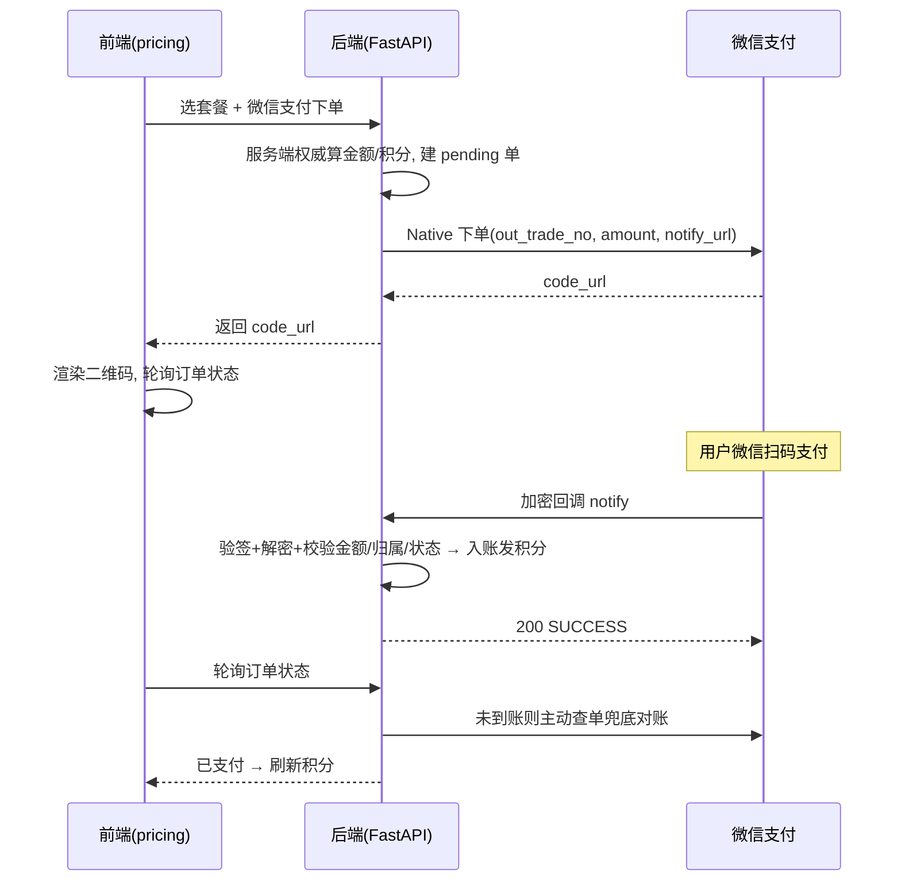

# 微信 Native 支付充值接入方案与进展

> 面向项目管理视角的方案落档，便于后续回溯。技术细节见 `code/backend/README.md` 与 `wiki/`；
> 承接计费系统（`doc/20260614/`）与财务后台增强（`doc/20260615/`）。

## 一、背景与目标

计费系统已上线积分钱包 + 复式记账，充值环节当前仅为开发期 Mock 支付。本期目标：**实装微信支付（Native / PC 扫码）真实充值**，让用户在 PC 网页扫码付款、积分自动到账，并保证资金口径与对账的财务严谨性。

参考微信支付官方文档：Native 支付开发指引 `https://pay.weixin.qq.com/doc/v3/merchant/4012791891`。

## 二、为什么是 Native 支付

星页是 PC 网页应用，Native 支付正是「PC 端网页扫码收款」的标准产品形态：后端下单获取二维码链接 `code_url`，前端转成二维码展示，用户用微信「扫一扫」完成支付。相比 JSAPI（微信内网页）、H5（移动浏览器），Native 与当前主场景最契合，故本期**仅做 Native**。

## 三、关键决策（已确认）

| 项 | 决策 |
| --- | --- |
| 支付场景 | 仅 Native（PC 扫码） |
| 验签模式 | 微信支付公钥模式（非平台证书模式，免证书轮换，更稳） |
| 接入方式 | 引入成熟库 `wechatpayv3`，复用现有「同步 SDK + `asyncio.to_thread`」范式 |
| 订单号 | `out_trade_no = 订单 UUID 的 hex`，回调可逆向还原，无需额外字段 |
| 记账口径 | 1002 应收第三方支付 + 结算入口（手动入账 + 资金账单自动对账，两者均本期交付） |
| 账单商品描述 | 按套餐动态拼：`星页-积分充值-{套餐名}` |
| Mock 支付 | 保留，仅非生产环境可用；生产只走微信 |

## 四、资金与记账模型

微信支付的钱并非实时到银行账户：用户付款后资金先在微信支付账户，按周期（约 T+1）结算到银行卡，期间扣手续费（约 0.6%）。因此采用「应收 → 现金」两段式，口径与既有「供应商预付用 1102 资产对账」一脉相承：

- 充值支付成功：`借 1002 应收第三方支付 / 贷 2001 预收账款-充值积分`
- 结算到银行卡：`借 1001 现金 / 贷 1002`，手续费 `借 6603 支付手续费 / 贷 1002`

这样 `1002` 余额 = 微信账户里尚未结算的钱（可与微信资金账单对账），`1001` = 真实银行现金。

结算入账分两种方式（本期都做）：

- **手动入口**：管理员「微信结算到账」操作，作为兜底。
- **自动对账**：拉微信「申请资金账单」(`fundflowbill`)，按账单日期幂等解析结算/手续费并入账，与阿里云账单对账逻辑同构。

## 五、下单与到账流程

## 六、安全要点

- **价格服务端权威**：客户端只传套餐 key，金额/积分服务端算。
- **回调校验**：先验签再解密；校验订单归属 + 金额一致 + 状态 SUCCESS 才入账；校验回调时间戳防重放。
- **幂等**：订单 `pending→paid` 原子流转 + `(provider, provider_txn_id)` 唯一索引，重复回调不重复发积分。
- **查单兜底**：回调丢失时，订单状态查询会主动查微信对账。
- **密钥安全**：所有凭据与私钥仅放服务器 `config/wechatpay.env` 与 `config/certs/`，均 gitignore，不入库。

## 七、交付范围（本期）

1. 微信支付配置与凭据接入（公钥模式）。
2. 后端：Native 下单、加密回调、订单状态查询（含查单兜底）。
3. 记账：微信订单走 1002 口径 + 管理员手动结算入口。
4. 资金账单自动对账（结算/手续费幂等入账）+ 后台「微信资金对账」入口。
5. 前端：充值页二维码弹窗 + 轮询到账 + 刷新积分。
6. 数据库迁移：订单号字段、`6603 支付手续费` 科目。
7. 测试与 1 元真实小额支付全链路验证。

## 八、需业务方提供

- appid（已认证并与商户号绑定）。
- 商户号 mchid、APIv3 密钥、商户私钥 `apiclient_key.pem` + 证书序列号、微信支付公钥 `pub_key.pem` + 公钥ID。
- 上述写入服务器 `config/wechatpay.env`（模板见 `config/wechatpay.env.example`）与 `config/certs/`。

## 九、进展

- 2026-06-17：方案确认，落档；创建配置模板 `config/wechatpay.env.example`。
- 2026-06-17：**后端 + 前端开发完成**（待配回调地址后联调测试）。
  - 后端：新增 `code/backend/app/services/payment/wechat/`（公钥模式客户端：Native 下单 / 查单 / 回调验签解密 / 资金账单解析，懒加载单例，同步调用经 `asyncio.to_thread` 包裹）。
  - 路由：`/api/billing/recharge` 增支付方式分支（微信返回 `code_url`、mock 仅非生产）；新增 `/api/billing/wechat/notify` 回调与 `GET /api/billing/recharge/{id}` 状态查询（含查单兜底）。
  - 记账：`apply_recharge` 按 provider 选现金科目（微信→1002）；新增手动结算与按资金账单按日幂等入账（借 1001 + 6603 / 贷 1002）。
  - 后台：新增「微信资金」Tab（资金账单拉取/入账 + 手动结算兜底）；财务总览增「应收第三方支付」「支付手续费」，营业利润扣减手续费。
  - 数据库：迁移 `015_wechat_payment.sql`（`recharge_orders.out_trade_no` 唯一可空 + 历史回填、`6603 支付手续费` 科目）。
  - 前端：`pricing` 页接微信扫码弹窗（`qrcode` 依赖本地生成二维码）+ 轮询到账 + 刷新积分，开发期保留 mock。
  - 测试：纯逻辑单测 `tests/test_wechat_pay.py`（订单号还原 / 金额换算 / 资金账单解析）通过；用真实私钥+公钥验证公钥模式客户端可构造（无网络）。
- 2026-06-27：**真实支付主链路验证通过**。
  - 配置：`config/wechatpay.env` 与 `config/certs/` 已在服务器归位，后端重启后 `WECHATPAY_APPID` 生效；补齐可提交模板 `config/wechatpay.env.example`。
  - 前端：曾发现线上 `.next` 仍为旧构建，创建微信订单后误走 `/mock-pay`；已重新 `npm run build` 并重启 `star-page-frontend.service`。
  - 验证：用户完成一笔 10 元微信 Native 扫码支付，微信回调 `/api/billing/wechat/notify` 返回 200；订单状态 `paid`，微信交易号已写入 `provider_txn_id`。
  - 到账：用户增加 1000 付费积分，余额刷新正常；财务分录为 `借 1002 应收第三方支付 10 / 贷 2001 预收账款-充值积分 10`。
- 待办：等待微信 T+1 资金账单后，在后台「微信资金」拉取首笔真实资金账单，校验业务类型归类（结算/手续费）并完成 `1002 → 1001/6603` 结算入账验证。
